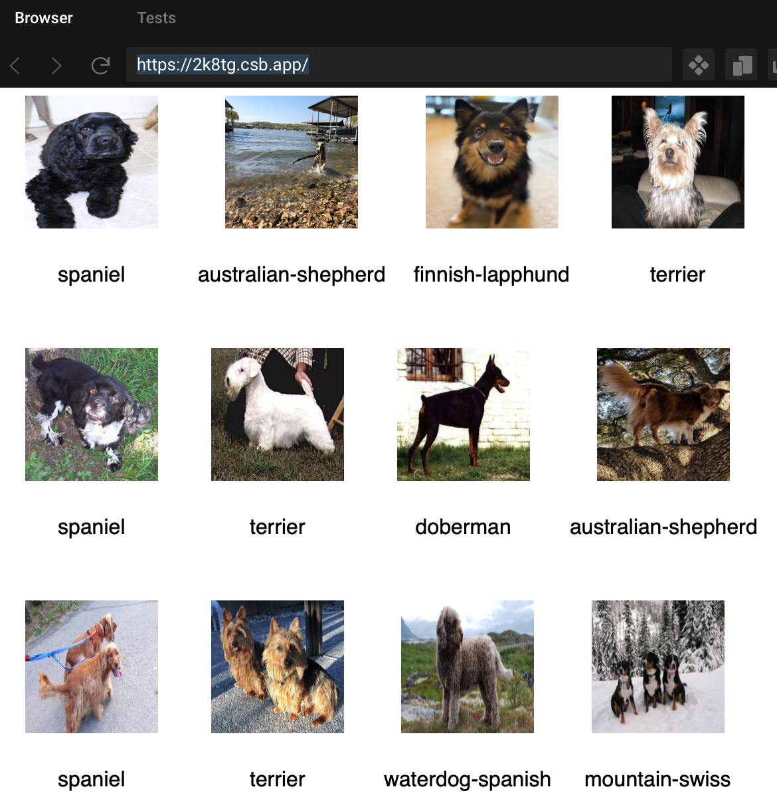

# Dogs-Lovers

Dogs-Lovers es un reto perteneciente a los ejercicios de [Gym](https://github.com/Laboratoria/gym/tree/DEV009) de Laboratoria. 

Este simple reto consiste en renderizar la data brindada de los perritos, con sus imágenes y sus razas.

El ejemplo es este:

El resultado final se puede consultar [aquí]()
